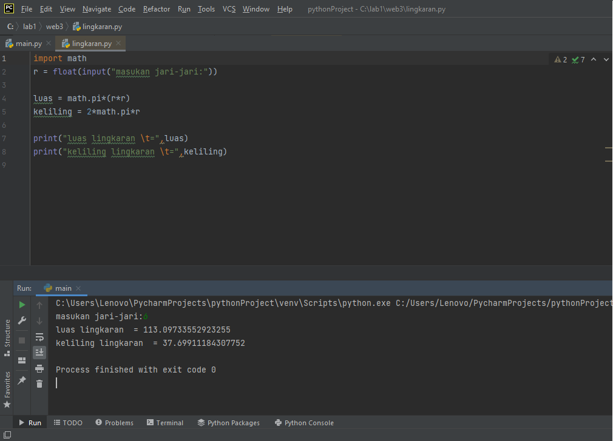
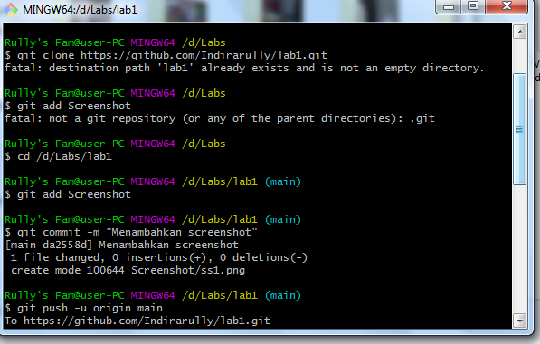

# lab1
## Belajar mengedit python dengan pycharm

### Indira Rully 312110354
Berikut Program yang saya import dengan modul math dan syntax yang disediakan oleh Python dengan bantuan program aplikasi PyCharm. 

Untuk r saya memasukan fungsi "input()" yang nilainya di konversi ke tipe data/syntax "float" karna tipe data tersebut menyatakan bilangan yang mempunyai koma.

Dalam rumus luas dan keliling saya menggunakan perintah "math.pi" untuk menyertakan nilai phi yang tersedia dalam modul. Selanjutnya tambahkan fungsi "Print()" untuk menampilkan data tersebut. di dalam print saya memasukan syntax "\t", syntax tersebut merupakan karakter espace yang memiliki fungsi untuk membuat tab.

Berikut merupakan pseudocodenya

Ini saat push repository ke github

Dan ini flowchartnya

